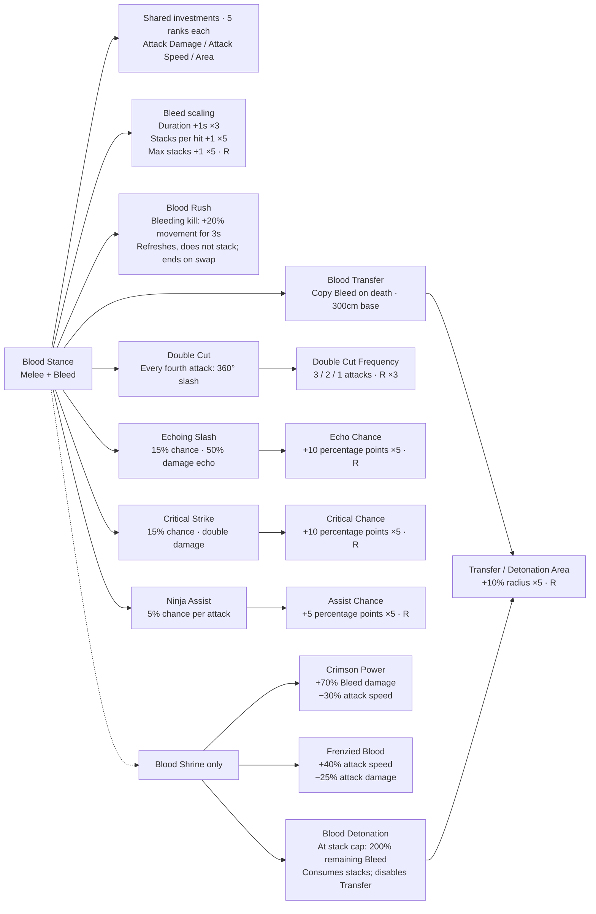
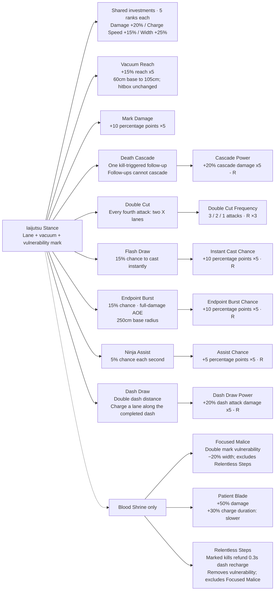
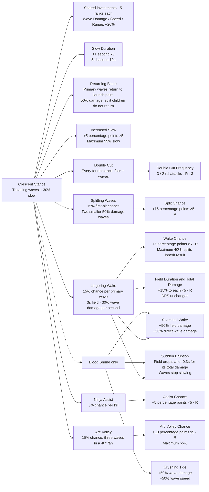

# Samurai stance audit

Audited 2026-10-03 against the saved upgrade pool, runtime combat code and acquisition rules. See [Build families](BuildFamilies.md) for asset paths and authoring controls.

There are **63 enabled Samurai card assets**, organized into **three equal 21-card trees**. Each contains the stance plus **20 upgrades**. The nine damage/speed/size assets represent three shared investments that convert when a stance is chosen. Eight other Samurai cards remain disabled. The full game catalog has **106 cards, 98 enabled**.

| Category | Blood | Iaijutsu | Crescent |
| --- | ---: | ---: | ---: |
| Stance starter | 1 | 1 | 1 |
| One-time mechanics | 6 | 6 | 6 |
| Normal scalable | 5 | 5 | 5 |
| Rare scalable | 6 | 6 | 6 |
| Shrine tradeoffs | 3 | 3 | 3 |
| **Total** | **21** | **21** | **21** |

Vacuum Reach fills Iaijutsu's fifth normal slot. Returning Blade fills Crescent's sixth one-time slot. Mark Duration and Tidal Step are not part of the trees.

## Shared investments

All three ordinary cards can be acquired before the first Samurai trial. Choosing a stance converts existing ranks and future offers to the relevant form. Each investment has five ranks total. Converted Rare/Epic bonuses retain their strength relative to a Common rank; mastery and banishments carry over. Old modifiers are cleared before applying the new form. Saving and restoring does not repeat the bonus.

| Investment | Before choosing / Blood | Iaijutsu | Crescent |
| --- | --- | --- | --- |
| Damage | Attack Damage: +20/30/45% at Common/Rare/Epic | Iaijutsu Damage: +20% per new rank | Wave Damage: +20% per new rank, including field damage basis |
| Speed | Attack Speed: +10/15/22% | Charge Speed: +15% per new rank; shortens the charge | Wave Speed: +20% per new rank; changes travel speed |
| Size / reach | Area: +15/25/40% | Width: +25% per new rank | Range: +20% per new rank |

For example, two Common Area ranks become two Width ranks (+50%) or two Range ranks (+40%). One Rare Area rank is worth 25/15 Common ranks and retains that relative strength when converted. Iaijutsu/Crescent's new ranks retain their existing fixed per-rank tuning. Global bonuses remain separate.

The former one-rank Heavy Blade tradeoff is now ordinary Attack Damage, retaining internal ID `SamuraiHeavyBlade`. Its old speed penalty is retired; an older save without a stored magnitude keeps its +40% damage investment. Legacy saves containing several forms merge their invested strength and use the shared five-rank ceiling; conversion itself never grants mastery.

## Blood Stance

Normal melee with **+35% area**, **+30% attack speed** and intrinsic Bleed. Each Bleed stack deals **12.5% of the applying hit over 3 seconds**, ticking every 0.5 seconds. Applications refresh all stacks. Base cap is five, rising to ten. Blood has **6 one-time mechanics, 5 normal scalable cards, 6 Rare scalable cards, and 3 Shrine tradeoffs**.

Solid arrows show prerequisites. **R** means Rare; **×N** is the rank cap. The three stat forms in each tree are the shared investments above. Each Shrine reward is one-time and requires its own stance.

Transfer Area requires **either** Blood Transfer **or** Blood Detonation. Detonation affects the original target and nearby enemies and applies no Bleed. Echoes arrive after 0.15 seconds, can crit and call assists, and advance attack/Double Cut counters; they cannot echo again. Critical and Echo chances reach 65%; Assist reaches 30%. The three Shrine tradeoffs can coexist.

## Iaijutsu Stance

A spectral attacker charges along an **800cm lane**, **200cm full base width**, with a **1-second charge** and separate **0.5-second cooldown**. The lane hits once at completion. Vacuum reaches 60cm beyond the lane at 240cm/s; Vacuum Reach extends it to 105cm without changing the damage lane. Hits apply a **3-second mark granting +50% damage taken**; the applying hit does not benefit from its own new mark. The real Samurai plays `AM_SamuraiIaijutsu` once per normal attack, timed to the charge, and stays free to move or dash. Root motion and ordinary melee damage are disabled for this presentation. The spectral copy keeps the original attack animation; dash and cascade lanes do not replay the player montage. Montage speed follows Charge Speed (1 second base, about 0.57 seconds at five ordinary ranks); character/global attack-speed buffs only reduce the separate cooldown. Instant casts hit immediately with authored-speed animation. Iaijutsu has **6 one-time mechanics, 5 normal scalable cards, 6 Rare scalable cards, and 3 Shrine tradeoffs**.

Normal Iaijutsu charges follow the Samurai's position and current aim. Auto Targeting selects the nearest valid enemy; disabling it makes the hitbox follow cursor/controller aim, including empty space. Mouse rays read walkable ground instead of enemy bodies and fall back to a foot-height plane when needed. Changing aim or settings updates the current charge without resetting its progress. The indicator, spectral copy, vacuum, final hit, and Endpoint Burst use the same moving lane. Double Cut keeps a shared X midpoint and aim. If targets disappear, the charge follows the Samurai with its last aim and still completes. Death Cascade and Dash Draw retain their fixed victim origin and completed dash path.

Crossing lanes can each hit the same enemy; one X attack creates at most one cascade. Normal, dash and cascade attacks can roll instant cast/Endpoint Burst and advance the stance counter. A cascade cannot chain from either its lane or burst kills. The assist uses a one-second timer, not Tick, and cannot overlap a busy assist. Flash Draw and Endpoint Burst reach 65%; Assist reaches 30%. Mark Damage reaches +100% damage taken before Focused Malice, which doubles the vulnerability bonus. Charge Speed changes charging; global attack speed changes the separate cooldown.

Taking Relentless Steps converts existing Mark Damage ranks into Iaijutsu Damage and removes Mark Damage from future offers. Focused Malice and Relentless Steps cannot be acquired together. Old mixed saves retain Relentless Steps and convert the ineffective Focused Malice purchase into one damage rank, removing its width penalty. Conversions retain invested strength and mastery, even when merged damage ranks reach the five-rank ceiling.

Dash Draw also doubles Samurai dash distance while Iaijutsu is selected, keeping the original duration and charge cost. The slash uses the actual completed path, including wall-shortened dashes. Ninja does not receive the distance bonus. Cascade Power and Dash Draw Power each reach +100% damage for their own attack type, including crossing lanes and Endpoint Burst. Dash damage does not carry into a cascade. The vacuum compensates for opposing enemy movement and uses the enemy movement system's world sweep, so pursuit and floor contact do not cancel the pull.

## Crescent Stance

Timer-fired waves with **no normal melee damage**, alternating the two Blade Wave montages. Saved wave tuning is **40% of normal attack damage**, **300cm width**, **650cm travel range**, and **1,400cm/s speed**. Hits apply **30% slow for 5 seconds**; reapplication refreshes duration. Crescent has **6 one-time mechanics, 5 normal scalable cards, 6 Rare scalable cards, and 3 Shrine tradeoffs**.

Scorched Wake and Sudden Eruption require **both** Crescent's Shrine reward and Lingering Wake. Splits have 60% width/range and cannot split again, but can leave fields and slow. At the end of outbound travel, successful field procs leave a continuous strip from launch to the actual endpoint, using the wave's scaled width and end-cap thickness. Early hits do not shorten it; split waves inherit their parent's success or failure and leave their own narrower full-path strips only on inherited success. Fields stay fixed after the wave moves or disappears. Normal pulses and eruptions cover the full strip. There is no separate indicator or eruption flash: deposited Niagara ground debris persists until the field expires or erupts, including upgraded duration. The 3-second duration, or 0.3-second eruption delay, starts when outbound travel ends; each target receives one field damage budget. Arc Volley combines with Double Cut, producing twelve primary waves when both trigger. Split chance reaches 90%; Assist reaches 30%; Arc Volley reaches 65%; Wake reaches 40%. Wave pacts do not alter the field's damage basis. There is no Crescent kill-cascade upgrade.

Taking Sudden Eruption converts existing Increased Slow and Slow Duration ranks into Wave Damage and removes both from future offers. Field scaling adds 15% duration and **total** damage per rank with unchanged DPS: five ranks give 5.25 seconds and 1.75× total damage. Eruptions release the same budget; Scorched Wake multiplies it to 2.625× base total damage.

Returning Blade keeps one hit per enemy on each pass. The return uses the committed launch position, so player movement cannot stretch the path. Each wave gets only one split roll and one field opportunity across both passes; successful field procs commit the whole outbound strip before returning, with no duplicate field on the return. Split waves never return. They inherit the parent's original field result even after its field has spawned, and successful children leave their own fields. Returning Blade applies to all Double Cut and Arc Volley primary waves.

## Audit findings

| Finding | Current consequence |
| --- | --- |
| Shared investment conversion | Fixed: pre-stance cards remain useful, convert with ranks/quality, retain caps and survive restoration. Ordinary Attack Damage replaces the obsolete Heavy Blade speed-penalty tradeoff. |
| Ninja alternate montage | Fixed: both montage assets previously referenced the original clip. The alternate now references the baked mirrored sequence; pose checks cover both hands, and release uses the left hand. |
| Fourth Double Cut Frequency rank, all three stances | Fixed: three-rank caps yield 3/2/1 attacks. Stale assets cannot grant a fourth rank; old fourth ranks clamp to three with mastery preserved. |
| Relentless Steps with Mark Damage / Focused Malice | Fixed: Mark Damage converts into Iaijutsu Damage, then becomes unavailable. Focused Malice and Relentless Steps are mutually exclusive. Legacy conflicting ranks convert without losing mastery. |
| Sudden Eruption with both slow upgrades | Fixed: Increased Slow and Slow Duration convert into Wave Damage, then become unavailable. The pact remains selectable after investing in slow. |
| Field Duration and Damage scaling | Fixed: duration and total damage increase linearly to 1.75× base at five ranks; DPS stays unchanged. Eruptions use the same budget. |
| Assist triggers differ intentionally | Blood rolls per attack, Iaijutsu per second, Crescent per kill. All prevent overlapping assists. |
| Tree parity and proc scaling | All trees have 6/5/6/3 upgrade categories. Arc Volley Chance and Wake Chance now provide dedicated Rare branches. |

The three reported balance issues are addressed. Assist trigger differences remain intentional. Equal card counts do not guarantee equal combat strength; these are initial tuning values for playtesting.

The eight disabled cards are Overkill Burst, Expanding Ruin, Wave Volley, Crossing Blades, Splinter Wave, Force, Wide Arc and Velocity. Returning Blade is enabled for Crescent. They cannot be offered or acquired, and retained saved ranks are inactive. The three Shrine branches above only appear for their matching stance and are excluded from ordinary rewards. Samurai Tag Team keeps its separate assist slash; Grand Entrance keeps its separate circular proc.

## Verification and maintenance

The ground-only cursor correction passed the Development Editor build and `Iaijutsu`, `CrescentBuilds`, and `NinjaBuilds` suites. The shared mouse picker traces walkable static world surfaces, rejecting pawn bodies and pawn-owned meshes, then falls back to a foot-height plane. Tests reproduce the old Visibility hit on a mob and verify stable ground points as it moves through the ray, elevated ground behind walls, and empty-space fallback. Montage checks confirm ordinary attack-speed buffs affect cooldown only. The saved montage is 2.233 seconds with authored RateScale 1.0; fitting it to the 1-second base charge gives a runtime PlayRate of 2.233 before Charge Speed upgrades. Animation/charge tuning was not changed. Evidence: `Saved/Logs/IaijutsuGroundAimBuild.log` and `Saved/Logs/IaijutsuGroundAimRegression.log`.

Iaijutsu charge tracking passed the Development Editor build and `Iaijutsu`, `CrescentBuilds`, `TagTeamRegression`, and `GrandEntrance` suites. Coverage verifies player/target movement, manual aim changes and setting toggles during charge, indicator and spectral alignment, moving vacuum, unchanged progress, final-position damage, no damage from previous lane positions, shared X geometry, tracked Endpoint Burst, lost-target completion, and fixed dash/cascade origins. Normal lanes update after character movement and share one aim query per attack per frame. No saved asset migration was needed. Evidence: `Saved/Logs/IaijutsuTrackingBuild.log` and `Saved/Logs/IaijutsuTrackingRegression.log`.

The player Iaijutsu montage correction passed the Development Editor build and `Iaijutsu`, `CrescentBuilds`, `TagTeamRegression`, and `GrandEntrance` suites. The saved Samurai Blueprint plays `AM_SamuraiIaijutsu` on the real character while spectral lanes use the original attack animation. Coverage verifies base/upgraded charge timing, instant casts, Double Cut, disabled root motion, rejection of extra melee damage, missing-montage fallback behavior, stopping presentation, and independent dash/cascade animation. No saved asset migration was needed. Evidence: `Saved/Logs/IaijutsuPlayerMontageBuild.log` and `Saved/Logs/IaijutsuPlayerMontageRegression.log`.

The earlier Iaijutsu targeting correction passed the Development Editor build and `Iaijutsu` / `CrescentBuilds` suites. Coverage uses the actual Auto Targeting setting and shared manual-aim resolver, checking nearest-enemy selection, manual aim ignoring a closer enemy, empty-space attacks, setting changes between attacks, and the then-fixed direction during charge (superseded by charge tracking). Tests restore the original setting without saving preferences. Evidence: `Saved/Logs/IaijutsuTargetingBuild.log` and `Saved/Logs/IaijutsuTargetingRegression.log`.

The debris-only ground field passed the Development Editor build and rendered `CrescentBuilds`, `GroundSlashMotion`, and `GroundSlashFullEffects` suites. Tests verify deposited rocks remain visibly sized through base/max-duration fields, cleanup on expiry/eruption, absence of the separate blue indicator and eruption flash, and preservation of other wave layers. Only the working Niagara system was migrated; all card tuning and vendor assets were preserved. Evidence: `Saved/Logs/CrescentFieldDebrisFinalBuild.log`, `CrescentFieldDebrisFinalAssets.log`, and `CrescentFieldDebrisRegression.log`.

Split-field inheritance passed the Development Editor build plus rendering-enabled `CrescentBuilds` and `GroundSlashMotion`. Success and failure are inherited without another roll, even if the current chance changes or the parent's field already spawned before a return split. Tests verify each child's complete strip and all three debris layers. Lingering Wake and Wake Chance descriptions were updated with tuning preserved; other upgrade asset hashes were unchanged. Backups: `Saved/Backups/CrescentFieldShape/20261003_214000`. Logs: `Saved/Logs/CrescentSplitInheritanceBuild.log`, `CrescentSplitInheritanceAssets.log` and `CrescentSplitInheritanceRegression.log`.

The tree-completion update passed the Development Editor build and all 12 targeted suites: `SamuraiTreeStructure`, `SamuraiBuilds`, `Iaijutsu`, `CrescentBuilds`, `SamuraiStanceBalance`, `SamuraiRoster`, `SamuraiScalingConversion`, `TrialBuildRewards`, `GroundSlashMotion`, `BuildFamilies`, `NinjaBuilds` and `TagTeamRegression`. Tests cover the saved pool and category counts, Blood Rush refresh/expiry/swap behavior, separate cascade/dash damage scaling, vacuum reach, slow duration, proc chance scaling, return damage and launch-point targeting, split/field limits across both passes, legacy Returning Blade restoration, and both slow-card conversions. Evidence: `Saved/Logs/SamuraiStanceTreesFinalBuild.log`, `SamuraiStanceTreesAssets.log` and `SamuraiStanceTreesRegression.log`.

Asset migration verified 106 unique cards, 98 enabled and all three 6/5/6/3 category counts. Backups are in `Saved/Backups/SamuraiStanceTrees/20261003_205619`; all 99 unrelated upgrade asset files retained their hashes. New cards reuse existing stance illustrations. The new defaults still need gameplay balance testing.

`Tools/complete_samurai_stance_trees.py` authors the expansion from `Tools/samurai_stance_expansion.json`, with backups under `Saved/Backups/SamuraiStanceTrees`. It preserves unrelated card assets and verifies category counts and prerequisites. `-ValidateSamuraiTrees` is read-only. `SamuraiTreeStructure` covers equal categories, prerequisite gating, stale references, rank caps, ordinary rewards and restoration. Blood Rush uses death events plus one expiry timer; the new scaling cards add no per-frame polling.

The Iaijutsu vacuum and Dash Draw update passed the Development Editor build and the `Iaijutsu`, `NinjaBuilds`, and `SamuraiPushback` suites. Moving-target coverage runs at 30/60/120 FPS and checks floor contact, inclusive vacuum boundaries, walls, source restrictions, and normal movement after the slash. Dash coverage verifies doubled Samurai travel, unchanged duration, actual slash endpoints, wall-shortened paths, normal Ninja travel, and removal of the bonus on restoration without Dash Draw. `Tools/update_iaijutsu_dash.py` backed up and updated only Dash Draw, preserving all other upgrade assets. Evidence is in `Saved/Logs/IaijutsuVacuumDashFinalBuild.log`, `IaijutsuVacuumDashAssets.log`, `IaijutsuVacuumDashRegression.log` (Ninja/pushback), and `IaijutsuVacuumDashFinalRegression.log` (Iaijutsu after the boundary correction).

The earlier point-footprint field update passed the Development Editor build plus `CrescentBuilds` and `GroundSlashMotion`. Coverage verifies first-hit/end-point placement, smaller split fields, rotation, nonuniform scaling, vertical bounds, stationary snapshots after wave destruction, rectangular fallback visuals, one hit per enemy per pulse, and identical pulse/eruption coverage. `Tools/update_crescent_field_shape.py` migrated Lingering Wake with a backup and preserved all other upgrade assets. Logs are `Saved/Logs/CrescentFieldShapeBuild.log`, `CrescentFieldShapeAssets.log` and `CrescentFieldShapeRegression.log`.

The field now covers the completed outbound path. The Development Editor build and rendering-enabled `CrescentBuilds` / `GroundSlashMotion` suites passed. Tests verify launch/midpoint/endpoint damage, scaled width and end caps, no damage on untravelled ground, no premature field on early hits, the same full strip for Sudden Eruption, independent split strips, no return duplicate, failed procs producing no field, and proc-only debris. Lingering Wake's saved description was migrated with a backup under `Saved/Backups/CrescentFieldShape/20261003_212754`; other upgrade asset hashes were preserved. Evidence: `Saved/Logs/CrescentFieldPathBuild.log`, `CrescentFieldPathAssets.log` and `CrescentFieldPathRegression.log`.

The Development Editor build succeeded. All six balance regression suites passed: SamuraiStanceBalance, SamuraiBuilds, Iaijutsu, CrescentBuilds, SamuraiScalingConversion and TrialBuildRewards. Coverage includes saved three-rank caps, stale-reference rejection, both pact acquisition orders, real Shrine selection, normal/direct/repeat-trial offer exclusions, legacy conversions at the damage cap, repeated restoration, and actual field/eruption damage at every rank. Saved-asset validation passed for all nine updated cards; unrelated card hashes were preserved.

Runtime ownership: `PlayerUpgradeComponent.cpp` handles conversion/offers/restoration; `IaijutsuBuild.h` and `CrescentBuild.h` read converted magnitudes; `SamuraiAutoAttack.cpp`, `SamuraiIaijutsu.cpp`, `SamuraiBladeWave.cpp`, `SamuraiWaveField.cpp`, `SamuraiBuildUpgrades.cpp` and enemy status code execute the effects.

Saved assets are migrated by `Tools/configure_samurai_shared_scaling.py` and `Tools/fix_ninja_alternate_montage.py`, both with backups and read-only validation flags. `SamuraiScalingConversion` exercises live pre-stance acquisition, all three trials, Rare investments, continued purchases, rank caps, banishment, repeated restoration and the old Heavy Blade save. `NinjaAlternatingThrow` verifies montage tracks, mirrored hand poses, alternation and projectile release sockets. Existing Samurai, Iaijutsu, Crescent, trial-routing and draft tests cover the surrounding behavior.

`Tools/balance_samurai_upgrades.py` migrates only frequency caps and affected card descriptions, with backups under `Saved/Backups/SamuraiBalance`; `-ValidateSamuraiBalance` is read-only. Existing runtime tuning is preserved. Build/test evidence is in `Saved/Logs/SamuraiBalanceFinalBuild.log`, `SamuraiBalanceAssets.log`, `SamuraiBalanceRegression.log` and `SamuraiBalanceFinalRegression.log`.
